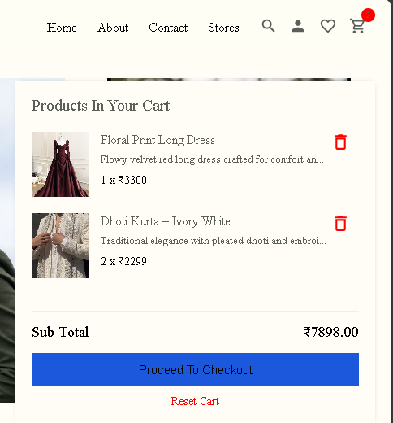
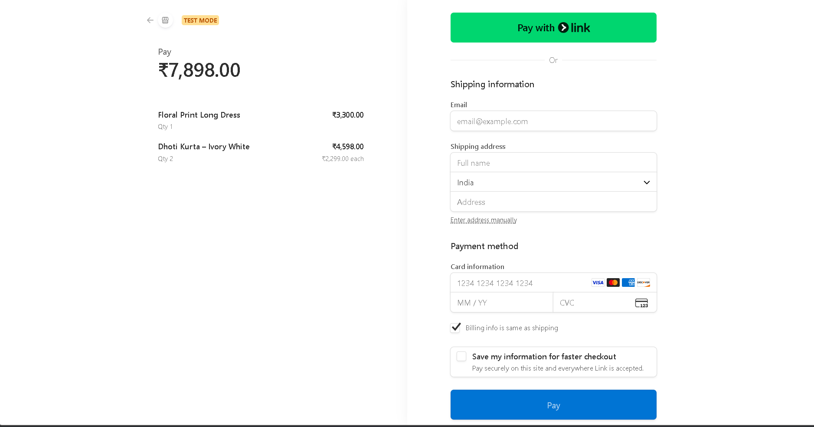

# 🛍️ Thread Nova — Modern Full-Stack E-Commerce Website

**Thread Nova** is a fully functional **E-Commerce Web Application** built using modern web technologies like **React.js**, **Redux Toolkit**, **SCSS**, and **Strapi (Node.js CMS)**.  
It provides seamless product browsing, cart management, and secure checkout using **Stripe Payment Gateway**.

🌐 **Live Demo:** [https://thread-nova-ecommerce.vercel.app/](https://thread-nova-ecommerce.vercel.app/)  
🖥️ **Backend (Strapi):** Hosted on Strapi Cloud  
🗄️ **Database:** MySQL (Development) → PostgreSQL (Deployed)

---

## ✨ Overview

Thread Nova offers users a smooth shopping experience with real-time product management from Strapi CMS, dynamic cart functionality powered by Redux Toolkit, and secure online payments using Stripe.  
The UI is built to be clean, responsive, and user-friendly, with SCSS modules ensuring modular styling.

---

## 🧩 Tech Stack

### Frontend

- ⚛️ **React.js** — Component-based UI library
- 🎨 **SCSS** — Modular and reusable styling
- 🧠 **Redux Toolkit** — State management for products, cart, and user
- 🧭 **React Router** — Navigation and routing between pages
- 💳 **Stripe API** — Secure payment gateway

### Backend

- ⚙️ **Strapi CMS (Node.js)** — Headless CMS for content & product management
- 🗄️ **Database:** MySQL (local) / PostgreSQL (on Strapi Cloud)
- ☁️ **Deployment:**
  - Frontend → **Vercel**
  - Backend → **Strapi Cloud**

---

## ⚙️ Features

### 🛒 User-Side Features

- Browse dynamic products from Strapi CMS
- Add / Remove items from cart
- Update quantity in cart
- Secure checkout using Stripe
- Responsive design for all devices
- Automatic total price calculation
- Category-based product listing
- Dark Mode and Light Mode

### 🧑‍💻 Admin / CMS Features

- Manage products easily through Strapi Admin Panel
- Add / Edit / Delete products dynamically
- Manage orders and transactions
- View payment logs from Stripe Dashboard

---

## 💳 Stripe Payment Flow

1. User adds products to cart
2. Proceeds to checkout
3. Redirects to **Stripe Checkout Page**
4. On successful payment → redirected to success page
5. Order details saved to Strapi backend

---

## 🖼️ Screenshots

> ⚠️ Add these screenshots inside a `/screenshots` folder in your repo and update paths below.

| Section                        | Preview                                            |
| ------------------------------ | -------------------------------------------------- |
| 🏠 **Homepage / Hero Section** |             |
| 🛍️ **Products Page**           |          |
| 🛒 **Cart Page**               |                |
| 💳 **Stripe Checkout**         |  |

---

## 🧰 Setup Instructions (Local Development)

### 1. Clone Repository

-- For Frontend

```bash
1. git clone https://github.com/SumantKrSingh/ThreadNova-Ecommerce
2. cd client
3. npm install
4. npm run dev
```

-- For backend

1. Clone or open your Strapi backend folder
2. cd api or your backend folder name
3. npm install
4. npm run develop
5. Connect MySQL or use Strapi’s local SQLite for testing

---

## 🔮 Future Improvements

-- 💖 Wishlist / Favorites System

-- 🔎 Advanced Product Filtering & Sorting

-- 🧾 User Authentication (Login / Signup / Logout)

-- 👤 User Profile & Order History

-- 📝 Product Reviews & Ratings

-- 💌 Email Notifications (Order Confirmation)

-- 📦 Better Admin Dashboard Analytics (Sales, Revenue, Users)

---

## 🧠 What I Learned

-- Integrating Strapi CMS with React frontend

-- Managing state efficiently using Redux Toolkit

-- Implementing secure payments via Stripe API

-- Deploying full-stack apps (Vercel + Strapi Cloud)

-- Handling real product data and API authentication

---

## 🤝 Connect

-- 👨‍💻 Developer: Sumant Kumar Singh

-- 📧 Email: ssumantkumar50@gmail.com

-- 🌐 Portfolio: https://sumantkumarsinghportfolio.netlify.app
